# Manual de despliegue de VSI para ejecución de servicios Node.js

## Pasos

1. Despliegue de Virtual Server on Classic

    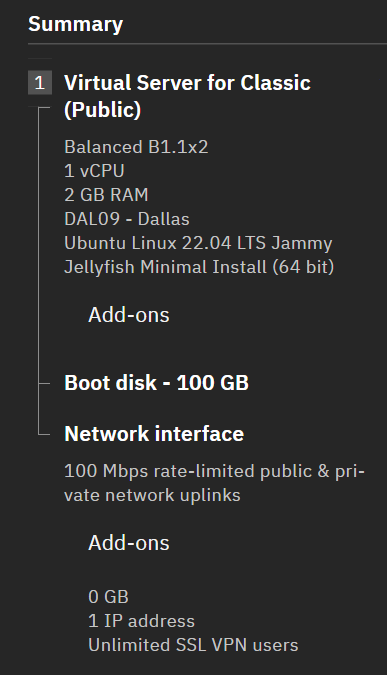

2. Instalación del cliente VPN
    - Se debe instalar la VPN de Motion Pro (Windows MotionPro client msi) [Descargar cliente](https://support.arraynetworks.net/prx/001/http/supportportal.arraynetworks.net/downloads/downloads.html)

        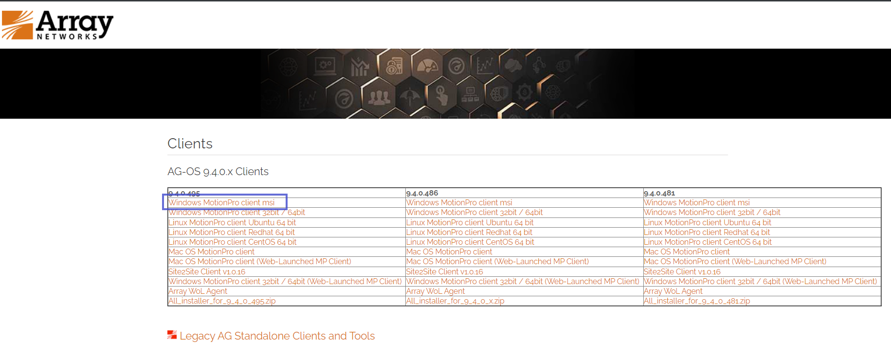

3. Iniciar sesión en el servidor de VPN

    - Luego de la instalación del cliente VPN se debe vincular a la red de Dallas **vpn.dal09.softlayer.com** dentro de las VPNs de este link [IBM VPNs](https://cloud.ibm.com/docs/iaas-vpn?topic=iaas-vpn-available-vpn-endpoints)

        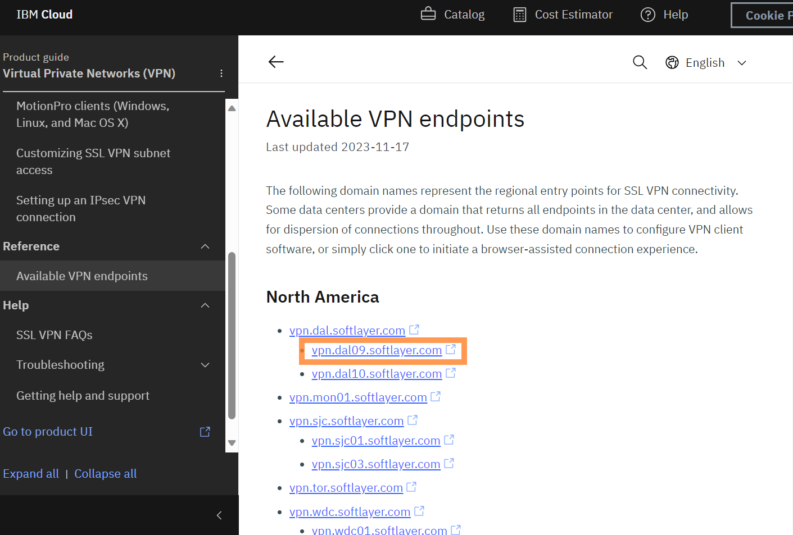

        > Se elige el servidor según la región donde fue creado el VSI

    - Al acceder al servidor de VPN observará la siguiente ventana
        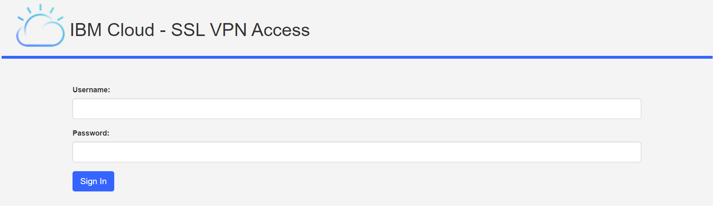

    - Para obtener las credenciales se accede a la consola de [IBM Cloud](https://cloud.ibm.com)

    - Luego seleccionamos la opción de IAM
        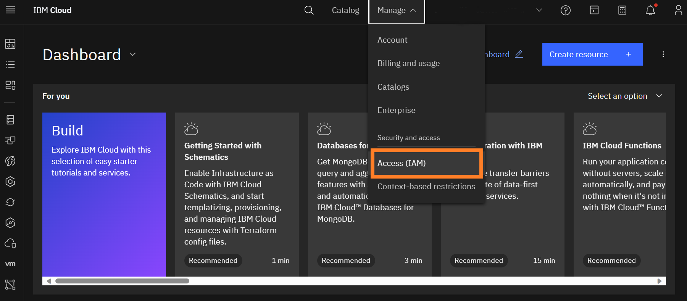

    - Dentro de IAM, acceder al usuario personal
        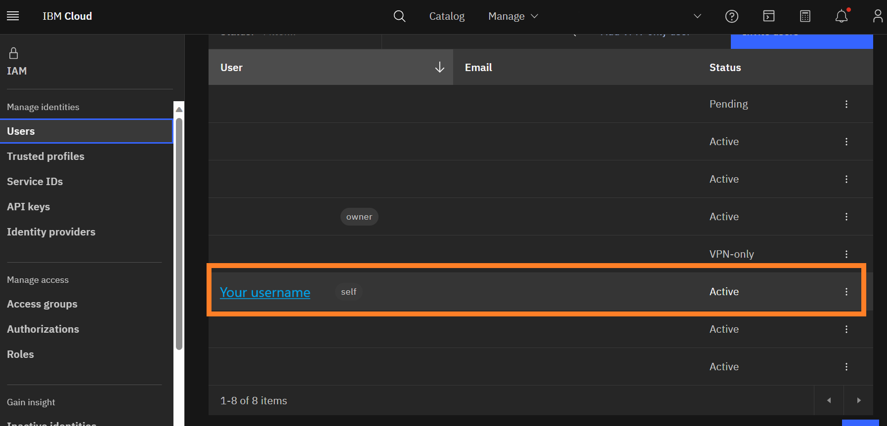

    - En la vista de Detalle de usuario, desplazarse hacia abajo y ubicar la sección **VPN Password**
        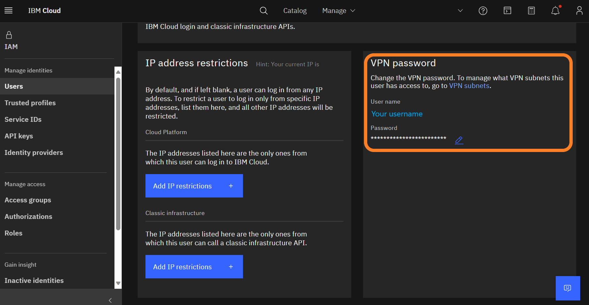
        
        > En caso de no tener la contraseña la puede actualizar dando clic al botón de editar.

    - Luego habilitar la opción para acceder a las subredes de la VPN de Infraestructura Clásica
        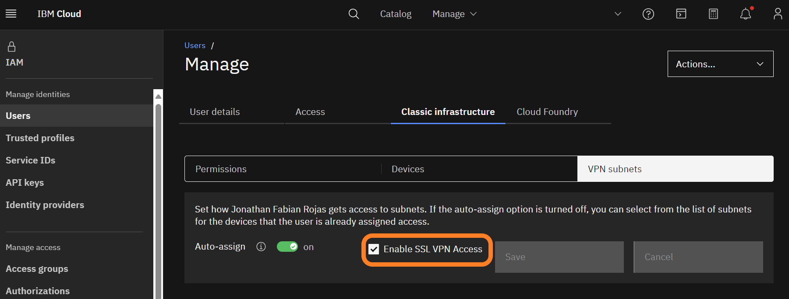

    - Finalmente colocar las credenciales en la ventana del paso inicial e iniciar sesión
        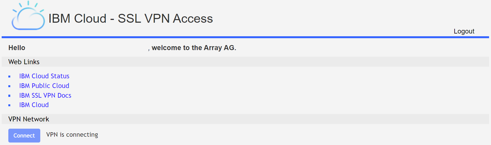

4. Iniciar sesión en la VSI

    - Acceder a la VSI de Infraestructura clásica
        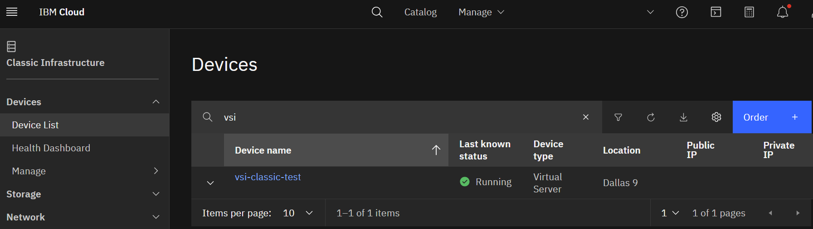

    - Obtener la contraseña de la VSI desde IBM Cloud
        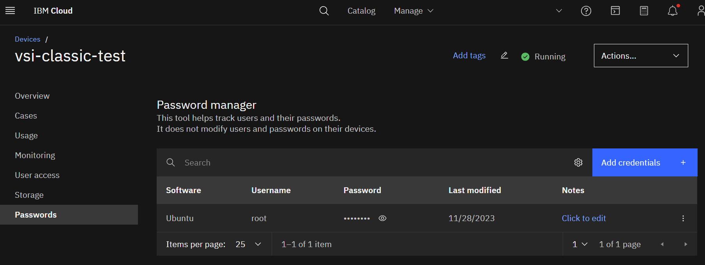

    - Utilizar el comando SSH e ingresar la contraseña del paso anterior
        ```
        ssh root@<IP PUBLICA>
        ```
        > La IP pública se obtiene desde la lista de recursos de la VSI o desde el Overview

5. Actualizar los paquetes para la aplicación de Node
    ```
    $ sudo apt-get update
    $ sudo apt-get install nodejs
    ```
    > Nota: Ejecutar en el VSI

6. Enviar códigos fuentes a la VSI
    ```
    scp -r /ruta/maquina/local root@<IP PUBLICA>:~/ruta/carpeta/vsi
    ```
    > Nota: Ejecutar desde la máquina local

    Luego ejecutar el comando que inicie el servicio, puede ser `npm run start`, `npm run dev`, etc.